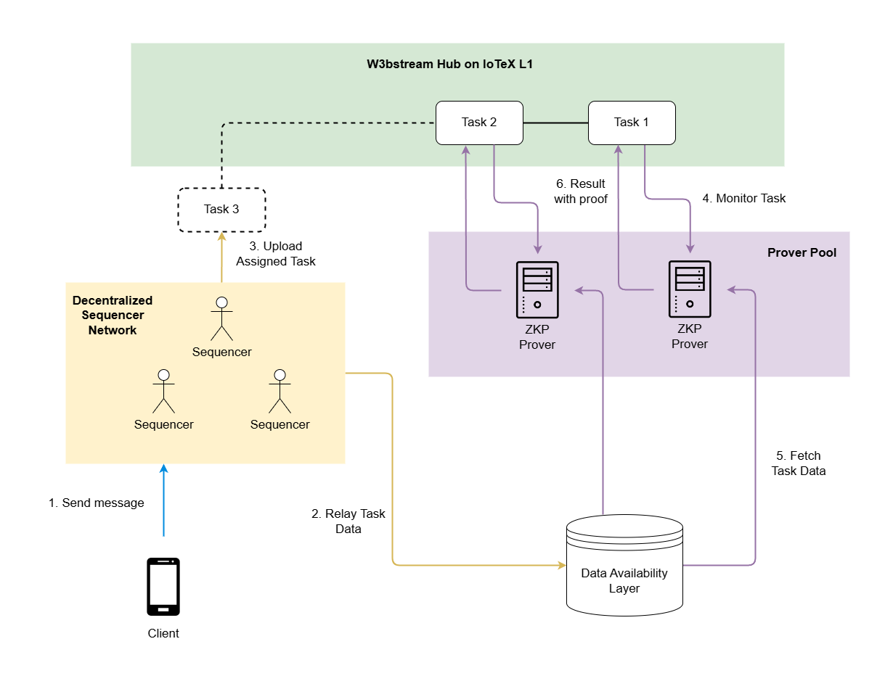

# IoTeX W3bstream (Sprout Release 🍀)

W3bstream is an integral part of the IoTeX network. It is a Layer-2 protocol orchestrated by the IoTeX Blockchain, dedicated to facilitating decentralized data processing in blockchain ecosystems. W3bstream nodes fetch raw data messages from supported data infrastructures and process them through project-specific ZK circuits to generate Zero-Knowledge (ZK) Proofs. These proofs are then dispatched to dApps on different blockchains and verified on-chain, enabling dApps to securely act on validated data insights. W3bstream enhances scalability and trust in blockchain applications, particularly where actions depend on the integrity of real-world data, such as in supply chain management, IoT, or any DePIN network where data authenticity triggers significant incentives on the blockchain.

## Workflow

  

The diagram represents the main components of the software and how they interact with each other. Note that this reflects a single entity running a sequencer and a prover. However, there are many entities running nodes in the network. More on this later.

- Sequencer: A sequencer assembles a set of input messages of the same project as a task and assigns the task to a prover. It receives messages from clients, persists them in data availability (DA), and packs them into tasks. The tasks will be sent to prover to generate proves, and the returned proves will be output to destination defined by the project.
- Prover: A prover generates proves with ZK virtual machines. It contains a task processor, ZK vm manager, project manager. Receiving a task, the prover constructs a ZK vm instance according to the corresponding project config and generates a ZK proof accordingly. Anyone can stake IOTX and obtain permission to run a prover.
- Data availability: data availability refers to a storage which ensures the life cycle persist of messages and tasks. It could be a database, a file system, a blockchain or a decentralized storage system, which implements the predefined interface.
- P2P network: In W3bstream, all sequencers and provers interact with each other over the P2P network, including dispatching, receiving, and reporting task status. To participate the processing of a project, a node needs to join the project topic and then process the information related to the project.
- IPFS: Project config data is stored on IPFS. Users who want to publish a new project can use [ioctl](https://docs.iotex.io/the-iotex-stack/reference/ioctl-cli-reference) to push the project config file to IPFS.
- Chain contract: Projects and provers are registered in IoTeX contracts. They are publicly available and open to all to register.
- ZK vm: Three ZK vms are supported, including Halo2, ZkWasm, and Risc0. A project could specify the vm to be used in the project.

## Architecture

[Detailed system architecture description →](./docs/ARCHITECTURE.md)

## Docker images

* [Sequencer](https://github.com/iotexproject/w3bstream/pkgs/container/w3bstream-sequencer)
* [Prover](https://github.com/iotexproject/w3bstream/pkgs/container/w3bstream-prover)

## Running

For users who just want to give it a try, please refer to [Quick Start →](./docs/QUICK_START.md), which will guide you through how to interact with existing projects deployed on testnet.

Developers looking to build circuits and deploy W3bstream projects should consult the [DEVELOPER_GUIDE →](./docs/DEVELOPER_GUIDE.md)

## Contract Deployments

Coming

## Contributing

We welcome contributions! Please read our [contributing guidelines](./docs/CONTRIBUTING.md) and submit pull requests to our GitHub repository.
