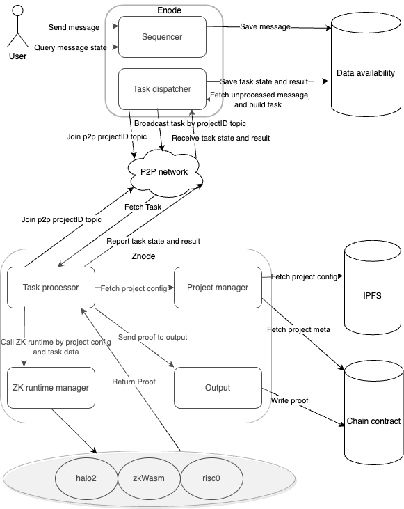

# IoTeX W3bstream (Sprout Release 🍀)

W3bstream is an integral part of the [IoTeX network](https://iotex.io). It's a decentralized offchain compute protocol orchestrated by the IoTeX Blockchain, dedicated to facilitating decentralized data processing in blockchain ecosystems. W3bstream nodes fetch raw data messages from supported data infrastructures and process them through project-specific ZK circuits to generate Zero-Knowledge (ZK) Proofs. These proofs are then dispatched to dApps on different blockchains and verified on-chain, enabling dApps to securely act on validated data insights. W3bstream enhances scalability and trust in blockchain applications, particularly where actions depend on the integrity of real-world data, such as in supply chain management, IoT, or any [DePIN network](https://iotex.io/blog/what-are-decentralized-physical-infrastructure-networks-depin/) where data authenticity triggers significant incentives on the blockchain.

## Architecture

  

The diagram represents the main components of the software and how they interact between them. Note that this reflects a single entity running a enode and znode. But there are many entities running nodes in the network. More on this later.

- Enode: is short for Eage node. Enode contains a sequencer and task dispatcher. Enode receives messages from users, persists them in DA, and packs them into tasks. Enode is defined by the project, and also, how to pack messages into tasks is defined by the project.
- Znode: is short for ZK node. Znode receives the task, constructs a ZK runtime instance, and generates a ZK proof. Znode contains a Task processor, ZK runtime manager, project manager, and output module. Everyone can stake IOTX and obtain permission to run a Znode.
- Data availability: W3bstream uses data availability to ensure messages and task lifecycles persist.
- P2P network: in W3bstream, all Enodes and Znodes will interact with each other over the P2P network, including dispatching, receiving, and reporting task status. Every node needs to join the project topic and then process the information related to the project.
- IPFS: project config data is stored on IPFS. Users who want to publish a new project can use ioctl to push the project config file to IPFS.
- Chain contract: Project meta data and Znode information are stored on the chain contract. If a project needs to be loaded by Znode, Znode needs to first fetch the project metadata from the chain contract, and then fetch the project configuration file from IPFS. 
- ZK runtime: currently W3bstream supports three ZK runtimes: Halo2, ZkWasm, and Risc0. The project configuration defines which runtime will be used by the project.

## Running

Just want to give it a try, see [Quick Start →](./QUICK_START.md)

For the initial setup and operation of a W3bstream node, please refer to the [OPERATOR_GUIDE →](./OPERATOR_GUIDE.md)

Developers looking to build circuits and deploy W3bstream projects should consult the [DEVELOPER_GUIDE →](./DEVELOPER_GUIDE.md)

## Contributing

We welcome contributions! Please read our [contributing guidelines](CONTRIBUTING.md) and submit pull requests to our GitHub repository.

## Community and support

We encourage you to seek support and ask questions in one of the following platforms:

### Join Our Discord Community

For real-time discussions and community support, join our Discord server where we have a dedicated
Developers Lounge category. This is a great place to get quick help, discuss features, and connect with other community members:

[Join the IoTeX Discord →](https://iotex.io/devdiscord)

### Ask on Stack Overflow

For more structured and detailed questions, consider using **Stack Overflow**. Many of IoTeX's core and expert developers prefer this platform for its non-realtime format, which encourages well-structured and comprehensive questions. Ask your question here:

[Stack Overflow - IoTeX Tag →](https://stackoverflow.com/questions/tagged/iotex)

and make sure it's tagged [`IOTEX`].
